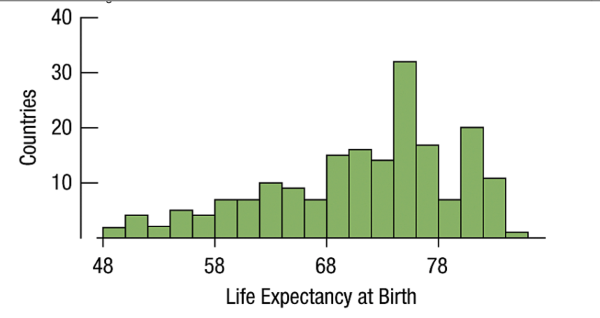

# PROBLEM SET 2

<!--Ordered List-->

1. The World Health Organization collected data on 190 countries on life expectancy at birth.
<!--Images-->

*(i)Describe whether this distribution is skewed to the left, skewed to the right, or symmetric. Also discuss its possible modes with an explanation.*

>This histogram is skewed to the left, since the tail extends towards the left. A possible mode would be a life expectancy at birth of of 76.
